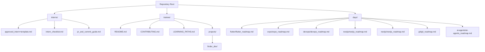
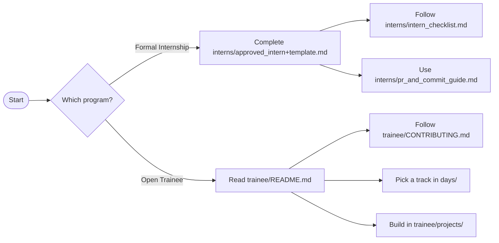

# 🚀 MasterFabric 100-Day Software Developer Roadmap

MasterFabric Information Technology Inc. builds exceptional software solutions—mobile apps, backend services, full‑stack web apps, and AI-powered systems. This repository contains a structured learning + delivery roadmap designed to take developers from **foundational skills** to **professional competence**.

## Tracks (quick view)

Quick overview of the available tracks. Open a roadmap for the full curriculum and day-by-day plan.

| Track | Duration | Focus | Roadmap |
|---|---:|---|---|
| Flutter | 100 days |   | [`/days/flutter/flutter_roadmap.md`](./days/flutter/flutter_roadmap.md) |
| Expo / React Native | 100 days |   | [`/days/expo/expo_roadmap.md`](./days/expo/expo_roadmap.md) |
| DevOps | 100 days |  | [`/days/devops/devops_roadmap.md`](./days/devops/devops_roadmap.md) |
| NestJS | 100 days |   | [`/days/nestjs/nestjs_roadmap.md`](./days/nestjs/nestjs_roadmap.md) |
| Next.js | 100 days |   | [`/days/nextjs/nextjs_roadmap.md`](./days/nextjs/nextjs_roadmap.md) |
| Git | 16 days |  | [`/days/git/git_roadmap.md`](./days/git/git_roadmap.md) |
| AI Agents | 100 days |  | [`/days/ai-agents/ai-agents_roadmap.md`](./days/ai-agents/ai-agents_roadmap.md) |

## Quick navigation

- **Start here**
  - **Formal Internship onboarding**: [`/interns/approved_intern+template.md`](./interns/approved_intern+template.md)
  - **Open Trainee program (Academy)**: [`/trainee/README.md`](./trainee/README.md)
- **Templates & rules**
  - PR/commit guide: [`/interns/pr_and_commit_guide.md`](./interns/pr_and_commit_guide.md)
  - Intern checklist: [`/interns/intern_checklist.md`](./interns/intern_checklist.md)
  - Trainee contributing: [`/trainee/CONTRIBUTING.md`](./trainee/CONTRIBUTING.md)
  - Learning paths index: [`/trainee/LEARNING_PATHS.md`](./trainee/LEARNING_PATHS.md)
- **Projects**
  - Trainee projects root: [`/trainee/projects/`](./trainee/projects/)
  - Example Next.js project: **FinderDev** → [`/trainee/projects/finder_dev/`](./trainee/projects/finder_dev/)

## Program core objectives

- **Track proficiency**: build strong competency in one track (mobile, backend, full-stack, or AI agents)
- **Architectural mastery**: Clean Code, Design Patterns, and professional application architecture
- **Quality assurance**: practical testing habits (**unit**, **widget/component**, **E2E**)
- **Professional workflow**: API design/integration, performance basics, and intro **CI/CD**

## Our commitment: the MasterFabric Manifesto

This program is guided by our core values.

- Read and acknowledge: `https://manifesto.masterfabric.co`

## Repository map (folders)

- [`/interns/`](./interns/): Formal internship resources, onboarding templates, and workflow standards
- [`/trainee/`](./trainee/): Open Trainee program (MasterFabric Academy) guides and projects
- [`/days/`](./days/): Track roadmaps (Flutter, Expo, DevOps, NestJS, Next.js, Git, AI Agents)

## Diagrams (Mermaid)

### Repository map

### Onboarding decision flow

## Programs & onboarding

This repository serves **two distinct programs**. Follow the instructions for your program.

### Formal internship program

Formal internship onboarding is managed through our internal platform:

- Onboarding platform: `https://welcome.masterfabric.co`

Upon approval, IT will create your corporate email (`internship.yourname@masterfabric.co`). Use the internal platform to connect with colleagues and complete onboarding.

### Open trainee program (MasterFabric Academy)

As a trainee in our open, non-profit program, your journey starts here:

- Getting started: [`/trainee/README.md`](./trainee/README.md)

## The 100-day pledge

Success is measured not only by task completion, but also by **code quality**, **test coverage**, and **problem-solving**.

## MasterFabric Academy (non-profit initiative)

This repository is also the home of the **MasterFabric Academy**, an open-source initiative that provides free learning roadmaps and a collaborative environment for trainees.

Learn more: [`/trainee/README.md`](./trainee/README.md)